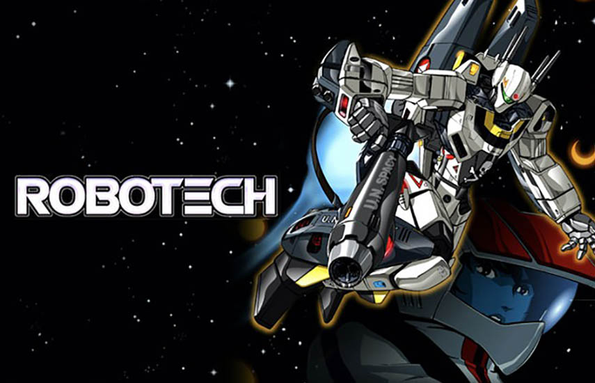
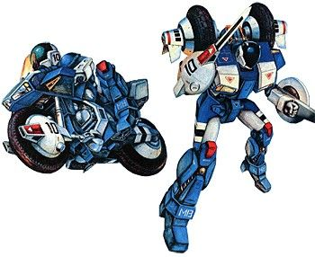
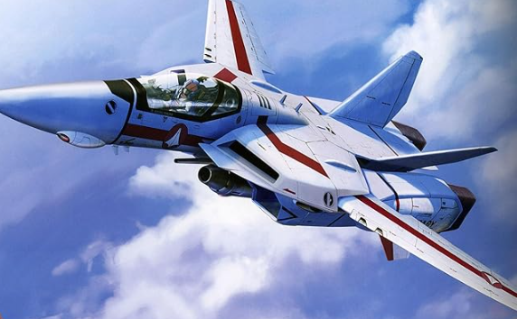
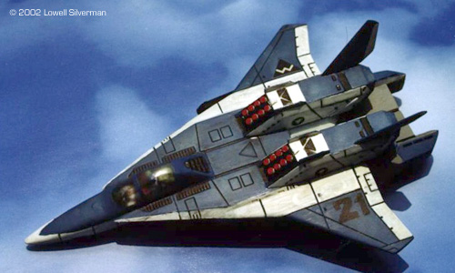
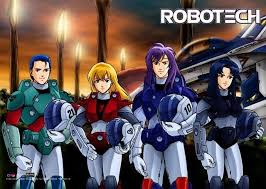
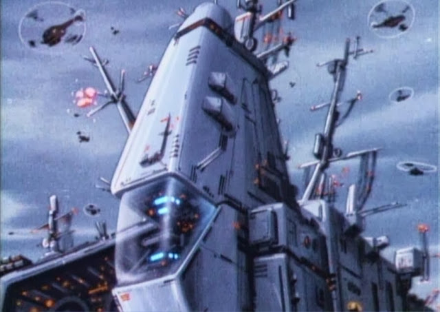

# Flota Robotech

Se nos pide desarrollar un sistema que debe administrar las diferentes naves y elementos relacionados con las operaciones y misiones de la flota Robotech.

## 1. Naves
Nos piden modelar las distintas naves que utiliza la flota en sus misiones. De cada nave nos interesa conocer:
- su peso, medido en toneladas;
- si es compatible con pilotos secundarios;
- su valoración, un número que indica qué tan eficiente es la nave;
- si es poderosa, lo cual es cierto cuando su peso es al menos 5 toneladas.
- la calidad, que puede ser 1, 2 o 3.

Consideraremos inicialmente estas naves:

### Cyclone

Cada Cyclone tiene un peso diferente y puede estar en modo batalla o en modo vehículo. Los Cyclones son compatibles con pilotos secundarios si están en modo vehículo.
También decimos que un Cyclone es especial cuando se cumple alguna de estas condiciones:
- Es poderosa
- Está en modo batalla

Su valoración es de 120 puntos si es especial, y de 80 en caso contrario.

### Veritech Fighter

Su peso es siempre de 5 toneladas y lógicamente no es compatible con pilotos secundarios.
A cada Veritech Fighter se le configura su tipo de arma, y la valoración de la nave se calcula como 60 + valoración del arma.
Los tres únicos tipos de armas posibles en nuestro modelo son:
- Rifle estándar otorga 0 puntos;
- Cañón de partículas otorga 20 puntos;
- Misiles de alto impacto otorgan 45 puntos.

### Alpha Fighter

Está basada en el Veritech Fighter, pero con las siguientes diferencias:
- Su peso es el doble el de una Veritech Fighter
- Es compatible con pilotos secundarios.
- Para cada Alpha Fighter, se informa mediante un string cuál es su modelo (por ejemplo: "AFC-01" o "AFC-02").
- A la valoración se le suma otro plus que, como valor máximo, puede ser 17, y se calcula como 2 * cantidad de letras del nombre del modelo. Por ejemplo, si es "AFC-01" (que tiene 6 letras) el plus será de 12, pero si fuera "AFC-02B" (que tiene 7 letras) será 14.

## 2. Misiones
Para cada misión se nos indica las naves asignadas. De cada misión se conoce su nombre, la valoración y su peso.
El peso de la misión es la suma de los pesos de sus naves. La valoración de la misión se calcula como (15 * máxima calidad de sus naves) - cantidad de naves, y no puede dar un resultado negativo.
Por ejemplo, si una misión incluye las tres siguientes naves:
Cyclone, de calidad 2 y peso 1 tonelada,
Veritech Fighter, de calidad 3, armado con rifle.
Alpha Fighter, de calidad 1, armado con un cañón de partículas.
El peso de la misión es de 16 toneladas y la valoración sería de (15 * 3) - 3 = 42.

## 3. Pilotos

Ya tenemos las naves, ahora nos faltan los pilotos. 🎖️

De cada piloto nos interesa saber:
- su peso, medido en kilogramos;
- si le agrada o no una nave, lo cual dependerá del tipo de piloto. Implementar el método leAgrada(unaNave) a cada tipo de piloto.
- las naves que ha pilotado, una lista de todas las que haya utilizado. Implementar un método pilotar(unaNave) que la agregue a la lista, solo si le agrada. En caso que no le agrade, arrojar una excepción indicando esa situación;
y, si está satisfecho o no, lo cual explicaremos a continuación:
Para que un piloto esté satisfecho, se tiene que cumplir que el 1% del peso de las naves pilotadas sea mayor o igual su propio peso y además una condición adicional que podría definir cada tipo de piloto.
Consideraremos los siguientes tipos de pilotos:

### Pilotos secundarios
Les agradan las naves que son compatibles con pilotos secundarios y tienen una valoración mayor a 85.
La condición adicional para estar satisfechos es que ninguna nave pilotada sea poderosa.

### Pilotos de ataque
Simplemente les agradan las naves poderosas.
No tienen ninguna condición adicional para estar satisfechos.

### Pilotos tácticos
Les agradan las naves que pesan entre 6 y 12 toneladas, o tienen una valoración mayor a 100.
La condición adicional para estar satisfecho es que la cantidad de naves pilotadas sea par.

## 4. Comando de la Flota

Agregar al modelo el comando de la flota, que tiene todas las naves disponibles para las misiones y todos los pilotos disponibles.
Se quiere poder consultar:
- si tiene buena oferta para pilotos secundarios: esto es así si la diferencia entre naves compatibles y no compatibles con pilotos secundarios es de al menos 2.
- la nave poderosa con la máxima valoración entre las no compatibles con pilotos secundarios;
- dado un piloto, la lista de naves que le agradan.
También se pide poder elegir una nave para un piloto, cualquiera de las disponibles que le guste. Si no le gusta ninguna nave, lanzar un error. Si existe al menos una, hacer que el piloto la pilotee, sacarla de las disponibles en el comando y agregar el piloto al comando.

## 5. Test
Realizar al menos los siguientes tests.

### 5.1 Naves
- Valoración del Veritech Fighter con cañón de partículas y calidad 3. El resultado será: 80 (60 + 20)
- Valoración del Alpha Fighter con misiles de alto impacto, calidad 1 y modelo "AFC-02". El resultado será: 117 (60 + 45 + 12)
- Cyclone, de peso 1 tonelada de calidad y en modo batalla. El resultado de ser especial es: true
- Misión, que incluya un Cyclone, de calidad 1 y peso 2 toneladas, un Veritech Fighter, de calidad 3 con un cañón de partículas y un Alpha Fighter, de calidad 2 con misiles, modelo “AFC-02B”. El resultado de la valoración será de 42(15 * 3) - 3.

### 5.2 Pilotos
- Un piloto secundario de peso 68.5 kilogramos utiliza un Cyclone de 1 tonelada en modo batalla y dos Alpha Fighter con misiles de alto impacto y modelo "AFC-02". El resultado si está satisfecho es: False porque los 2 Alpha son poderosos.
- Un piloto de ataque de peso 80 kilogramos un Cyclone de 1 tonelada en modo batalla y dos Alpha Fighter con misiles de alto impacto y modelo "AFC-02". El resultado si está satisfecho es: Verdadero.
- Un piloto táctico le agrada utilizar un Veritech Fighter con misiles de alto impacto.
- Un piloto táctico NO le agrada utilizar un Veritech Fighter con rifle
